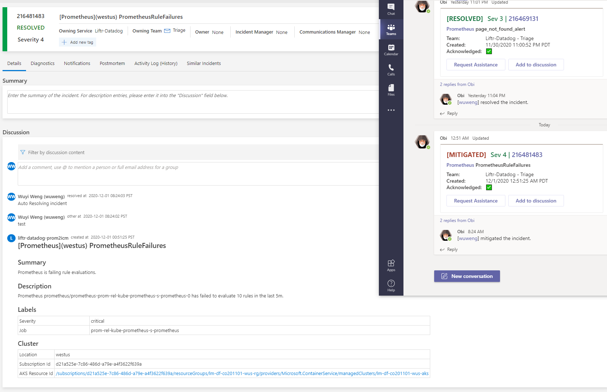
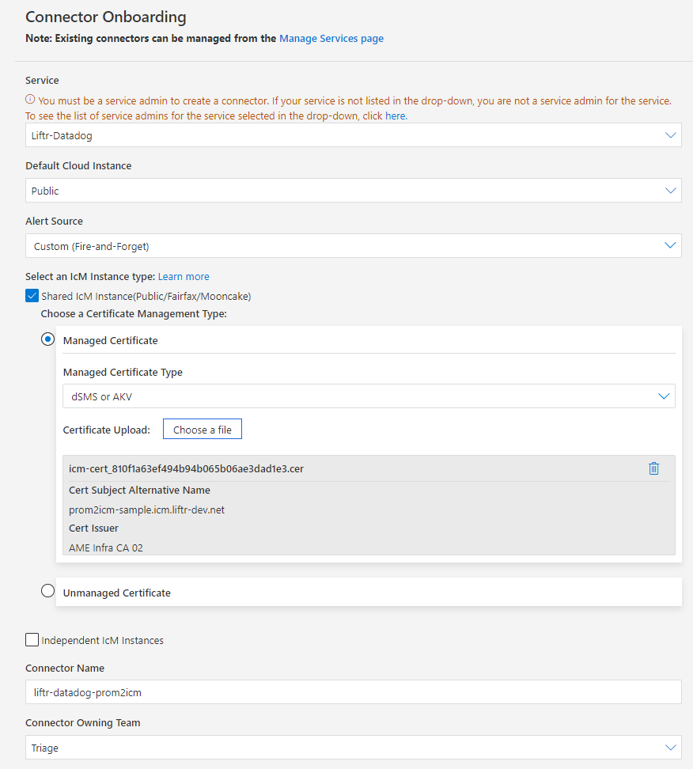

# prom2icm
prom2icm is a Prometheus IcM connector. It is a Prometheus [Alertmanager Webhook Receiver](https://prometheus.io/docs/operating/integrations/#alertmanager-webhook-receiver). It will receive the alerts from Prometheus, then transform and relay the alert to the corresponding IcM incidents. [Sample incident](https://portal.microsofticm.com/imp/v3/incidents/details/216481483/home):


# Usage
1. Generate a Key Vault AME issuer certificate for the connector. The prom2icm will fectch this certificate directly from key vault and keep checking for latest versions every 30 minutes. It is recommended to name the certificate as 'icm-cert' in the key vault to match the [default configuration](https://github.com/weng5e/liftr/blob/ab2ca83fc19213e7fb51d4645d9d473244f35bdc/helm/prom2icm/values.yaml#L20).

   a. If you are using [Liftr AKS operator](https://aka.ms/liftr/aks), [add a new subject name](https://msazure.visualstudio.com/Liftr/_git/Liftr.Metrics?path=%2Fsrc%2FDeployment.Runner%2Fhosting-options.json&version=GBmaster&line=15&lineEnd=15&lineStartColumn=10&lineEndColumn=54&lineStyle=plain&_a=contents) will be suffice.

   b. The certificate can also be manual generated following [this IcM documentation](https://icmdocs.azurewebsites.net/developers/ObtainingACertificate.html). Please keep in mind of the [Emergency Certificate Rotation (ECR)](https://keyvaultdocs.azurewebsites.net/AutoRotationAndECR/OverviewECR.html) requirements, e.g. certificate auto-renew under 90 days.

2. [Onboard a new IcM connector](https://portal.microsofticm.com/imp/v3/administration/connectoronboarding) for your service. The public part (.cer) of the key vault certificate from step 1 need to be uploaded. This 


3. Configure [aad-pod-identity](https://github.com/Azure/aad-pod-identity) for the prom2icm pod and grant certificate read permission to the key vault. The [label in the helm chart](https://github.com/weng5e/liftr/blob/ab2ca83fc19213e7fb51d4645d9d473244f35bdc/helm/prom2icm/templates/deployment.yaml#L19) is `aadpodidbinding: liftr-aad-pod-identity`. You can skip this step if you are using [Liftr AKS operator](https://aka.ms/liftr/aks).

4. Deploy the [prom2icm helm chart](https://github.com/weng5e/liftr/tree/ab2ca83fc19213e7fb51d4645d9d473244f35bdc/helm/prom2icm) to your AKS cluster.

   a. [Helm](https://helm.sh) must be installed to use the charts. Please refer to Helm's [documentation](https://helm.sh/docs/) to get started.

   b. Once Helm is set up properly, add the repo as follows: `helm repo add liftr https://weng5e.github.io/liftr/helm`
You can then run `helm search repo liftr` to see the charts.

   c. Install the helm chart

```console
helm install prom2icm-rel liftr/prom2icm \
--set icm.certificateKeyVault="https://your-key-vault.vault.azure.net/" \
--set icm.connectorId="your_connector_Id_from_step_2" \
--set icm.notificatEmail="youremail@microsoft.com"
```

5. Add the [receiver in your alertmanager configuration](https://msazure.visualstudio.com/Liftr/_git/Liftr.Metrics?path=%2Fsrc%2FDeployment.Runner%2Fdeployment%2Fscripts%2Fprometheus-stack-values.yaml&version=GBmaster&line=28&lineEnd=31&lineStartColumn=5&lineEndColumn=1&lineStyle=plain&_a=contents).

6. Define your alert rules. When you set a [number string in the severity label](https://msazure.visualstudio.com/Liftr/_git/Liftr.Metrics?path=%2Fsrc%2FDeployment.Runner%2Fdeployment%2Fscripts%2Fprometheus-stack-values.yaml&version=GBmaster&line=82&lineEnd=82&lineStartColumn=15&lineEndColumn=28&lineStyle=plain&_a=contents), it will be mapped to the IcM serv level, e.g. `severity: "3"` will map to Serv3.

# Contact
If you have any questions or feedback, please reach us!
wuweng@microsoft.com
liftrdev@microsoft.com

# Code
Helm chart:
https://github.com/weng5e/liftr

Prom2IcM:
https://msazure.visualstudio.com/Liftr/_git/Liftr.Metrics?path=%2Fsrc%2FLiftr.Prom2IcM